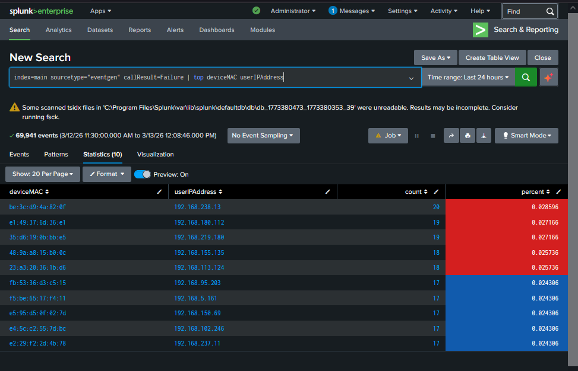

# Dashboard Design

After analyzing failure patterns in the dataset, a monitoring dashboard was created in Splunk to visualize system activity and highlight abnormal behavior. Dashboards allow analysts to observe system health in real time and quickly detect unusual patterns without manually searching through logs.

---

## Monitoring Workflow

```
Raw Log Events
      │
      ▼
Failure Detection
      │
      ▼
Failure Pattern Analysis
      │
      ▼
Dashboard Visualization
```

---

## Device / IP Failure Analysis

Before building the dashboard, the dataset was analyzed to identify which devices and user IP addresses were responsible for the highest number of failures.

### SPL Query

```
index=main sourcetype="eventgen" callResult=Failure
| top deviceMAC userIPAddress
```

This query ranks devices and IP addresses based on the number of failed call events.

### Analysis Fields

| Field | Description |
|------|-------------|
| deviceMAC | MAC address of the device generating the event |
| userIPAddress | IP address associated with the device |
| count | Number of failed calls |
| percent | Percentage contribution of failures |

### Screenshot



This analysis helps analysts identify:

- problematic devices
- misconfigured endpoints
- abnormal activity patterns

---

## Monitoring Dashboard

After identifying failure patterns, a Splunk dashboard was created to monitor system activity and failure trends.

The dashboard aggregates multiple panels to visualize key metrics in a single view.

### Dashboard Panels

| Panel | Purpose |
|------|--------|
| Failures by User | Displays failed call activity grouped by device |
| Total Calls by Host | Shows call activity trends across hosts |
| Failure Visualization | Displays total network failures |
| Failures by Partner | Identifies partners generating the most failures |

### Screenshot


The dashboard allows analysts to quickly observe:

- spikes in failures
- partner-related issues
- abnormal call activity
- system health indicators

---

## Why Dashboards Matter

Dashboards are widely used in Security Operations Centers (SOC) to monitor infrastructure in real time.

Instead of manually running searches, analysts can use dashboards to:

- detect anomalies quickly
- monitor system performance
- investigate abnormal activity
- support incident response workflows
