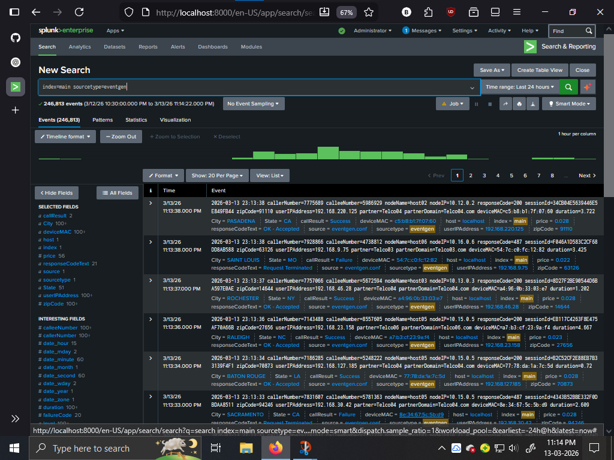
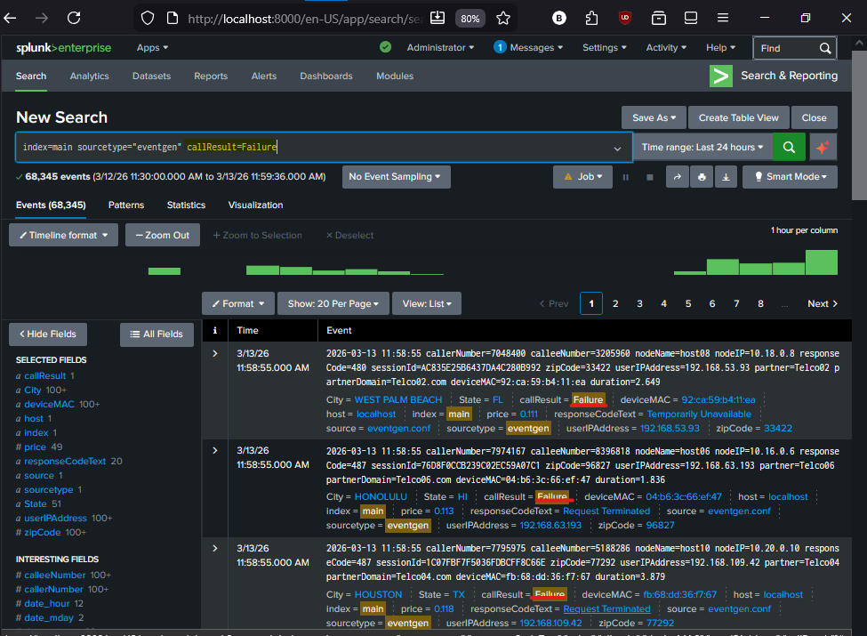
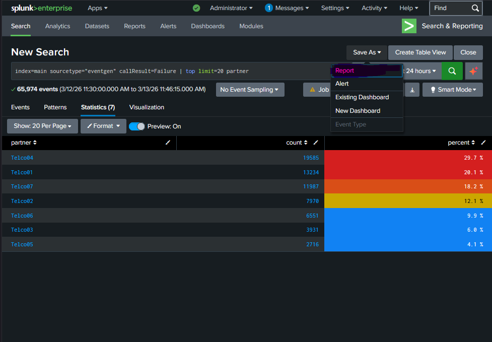

# Project Overview

This project demonstrates how Splunk can be used to analyze machine data, detect failures, and monitor system activity using SPL queries.

The dataset used in this lab was generated using the Splunk Eventgen application to simulate real system logs. The goal of the project was to explore the dataset, detect abnormal behavior, analyze failure patterns, and build a monitoring system using dashboards and alerts.

---

## Project Workflow

```
Raw Log Events
      │
      ▼
Data Exploration
      │
      ▼
Failure Detection
      │
      ▼
Failure Pattern Analysis
      │
      ▼
Monitoring Dashboard
      │
      ▼
Automated Alert Detection
```

---

## Data Exploration

The first step in the project was exploring the dataset to understand the structure of the events and identify useful fields for analysis.

### SPL Query

```
index=main sourcetype="eventgen"
```

This search retrieves all events generated by the Eventgen dataset.

### Screenshot



Important fields identified during exploration:

| Field | Description |
|------|-------------|
| callResult | Indicates whether the call was successful or failed |
| partner | Partner generating the event |
| deviceMAC | Device MAC address |
| userIPAddress | Source user IP address |
| responseCode | Response code returned by the system |

---

## Failure Detection

After understanding the dataset, the next step was identifying failed call events.

### SPL Query

```
index=main sourcetype="eventgen" callResult=Failure
```

This query filters events where the call result indicates a failure.

### Screenshot



This allows analysts to focus only on abnormal events and investigate system issues.

---

## Partner Failure Analysis

To determine which partners were generating the highest number of failures, the dataset was analyzed using the `top` command.

### SPL Query

```
index=main sourcetype="eventgen" callResult=Failure
| top limit=20 partner
```

### Screenshot



This analysis highlights partners responsible for the largest share of failed calls and helps identify potential service issues.

---

## Project Outcome

This project demonstrates how Splunk can be used to:

- explore machine data
- detect abnormal patterns
- analyze failure sources
- visualize system activity
- automate monitoring using alerts

The workflow implemented in this lab represents a simplified **SOC monitoring pipeline using Splunk SIEM**.
